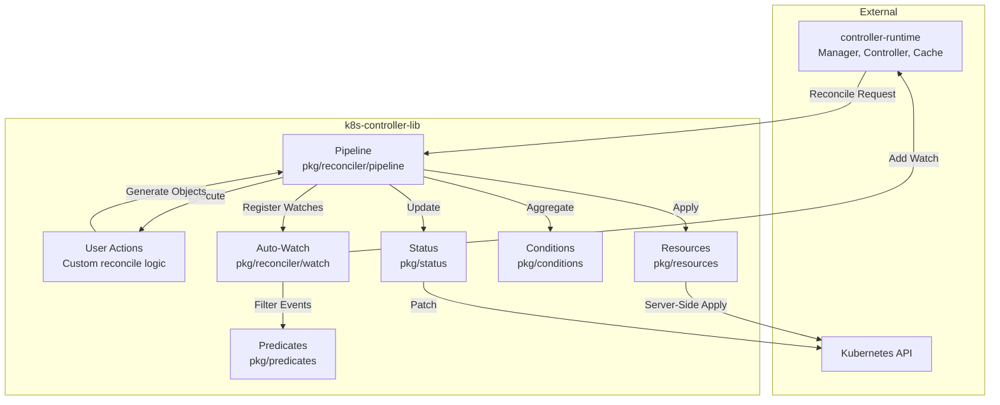
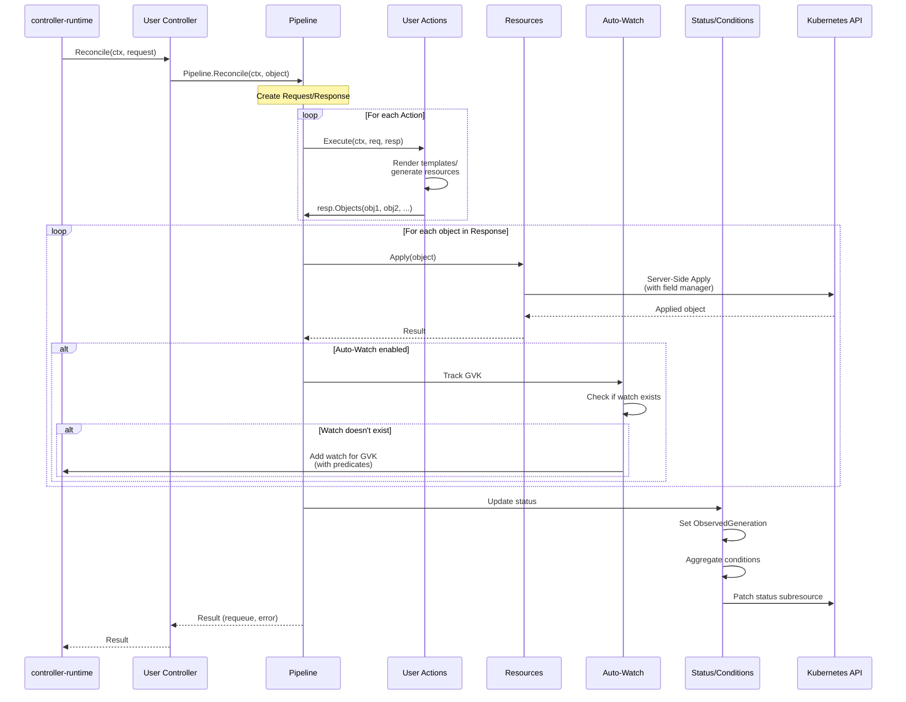
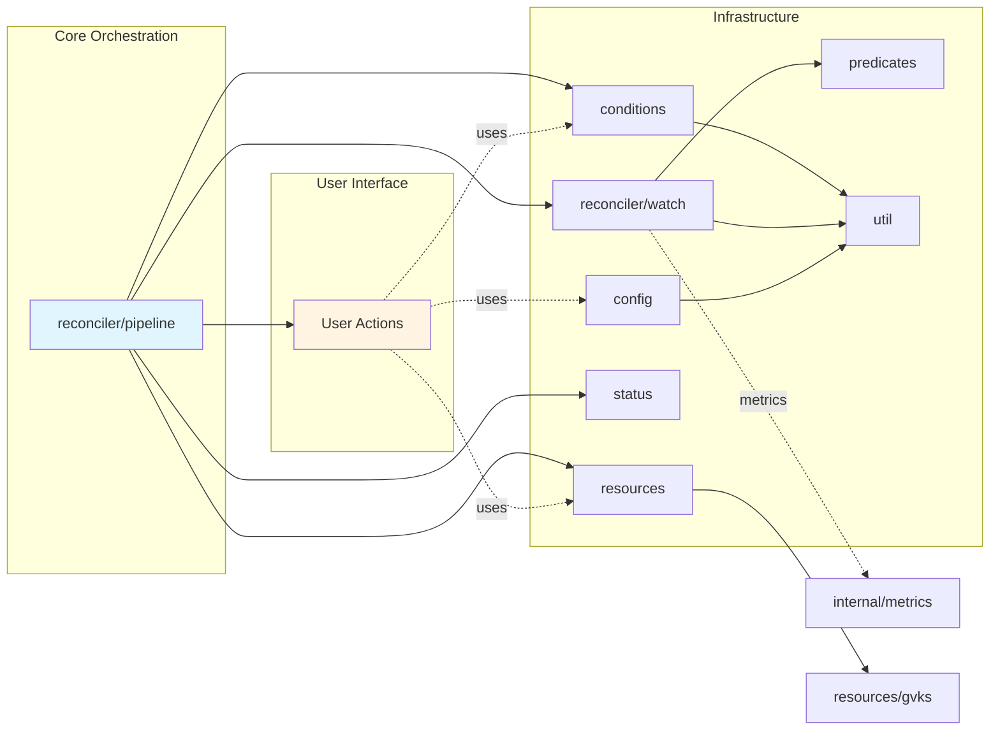
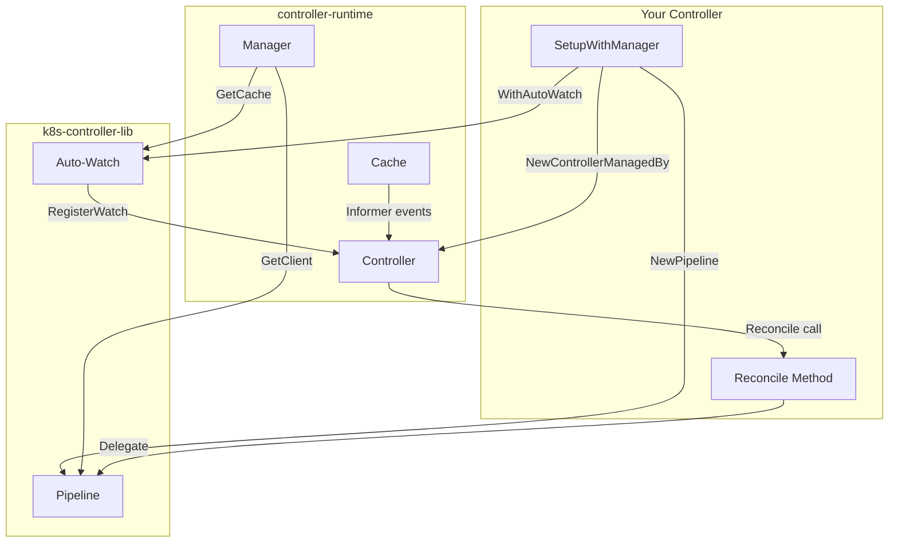
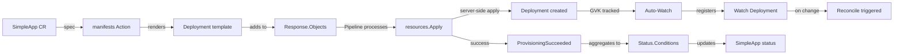

# Architecture Overview

This document provides a high-level overview of the k8s-controller-lib architecture, explaining how components fit together and when to use different patterns.

## Purpose

k8s-controller-lib provides reusable utilities for building Kubernetes controllers with controller-runtime. The library emphasizes:

- **Pipeline-based orchestration** - Structured reconciliation flow
- **Minimal abstraction** - Functions over interfaces where possible
- **Controller-runtime consistency** - Familiar patterns for existing users
- **Pragmatic defaults** - Sensible behavior out-of-the-box

## High-Level Architecture



**Key flow:**
1. controller-runtime calls user's Reconcile method
2. User delegates to Pipeline.Reconcile()
3. Pipeline executes user-defined Actions
4. Actions generate Kubernetes resources
5. Pipeline applies resources via server-side apply
6. Auto-watch registers watches for applied resources
7. Status and conditions updated automatically

## Reconciliation Flow



**Why this flow:**
- **Separation of concerns**: Actions focus on business logic, Pipeline handles infrastructure
- **Automatic status updates**: Reduces boilerplate in user code
- **Dynamic watches**: No manual watch setup for generated resources
- **Field manager tracking**: Clear ownership of fields via server-side apply

## Package Dependencies



**Dependency rationale:**
- **Pipeline is central** - Coordinates all other components
- **Util is foundational** - Generic Option[T] pattern used everywhere (including Config)
- **Actions are isolated** - User code has minimal required dependencies
- **Config is independent** - Can be used standalone in main() for controller setup
- **Internal packages hidden** - Metrics implementation is internal

## Components

### Pipeline (`pkg/reconciler/pipeline`)

**Purpose:** Orchestrates reconciliation lifecycle with automatic status management.

**Key features:**
- Executes user-defined actions sequentially
- Applies generated resources via server-side apply
- Updates status with ObservedGeneration and conditions
- Integrates with auto-watch for dynamic resource watching

**When to use:** Every controller using this library should use Pipeline as the entry point.

### Actions (User-defined)

**Purpose:** Custom reconciliation logic injected into the pipeline.

**Signature:**
```go
type Action func(ctx context.Context, req *Request, resp *Response) error
```

**Responsibilities:**
- Generate Kubernetes resources based on custom resource spec
- Add resources to Response via `resp.Objects()`
- Return errors to halt reconciliation

**When to use:** Define actions for any custom resource generation logic (e.g., rendering templates, computing derived resources).

### Resources (`pkg/resources`)

**Purpose:** Utilities for Kubernetes resource management.

**Key functions:**
- `Apply()` - Server-side apply for resources
- `ApplyStatus()` - Server-side apply for status subresources
- `ToUnstructured()` / `FromUnstructured()` - Type conversions
- `SetLabel()`, `SetAnnotation()` - Metadata helpers

**When to use:**
- Use `Apply()` for spec updates (automatically called by Pipeline)
- Use `ApplyStatus()` for status-only updates when Pipeline isn't managing status
- Use conversion utilities when working with dynamic/unstructured resources

### Result Helpers (`pkg/reconciler/result`)

**Purpose:** Utilities for creating reconciliation results with clear intent.

**Key functions:**
- `RequeueAfter(duration)` - Requeue with specific duration
- `RequeueIf(func() bool)` - Conditional requeue with default 1s delay
- `Success()` - Successful completion with no requeue
- `.After(duration)` - Fluent API to customize requeue delay

**When to use:** Use result helpers to make reconciliation return values more readable and self-documenting.

### Auto-Watch (`pkg/reconciler/watch`)

**Purpose:** Automatically watch resources generated by actions.

**Key features:**
- Tracks GVKs from applied resources
- Registers watches dynamically with controller
- Applies predicates to filter events
- Supports metadata-only watching (`Partial()`)
- Unified handler supports both OwnerReferences and label-based ownership

**Default Handler:**
The auto-watch feature uses `EnqueueRequestForOwnerOrLabel` which:
1. First checks for `OwnerReferences` (standard Kubernetes)
2. Falls back to `controller-lib.k8s.io/owner-*` labels if no owner references
3. No configuration required - works automatically

This means you can:
- Use `WithOwnership(true)` for owned resources → uses OwnerReferences
- Use `WithOwnership(false)` with `WithOwnerLabels(true)` → uses labels
- Mix both approaches in the same pipeline → handler adapts automatically

**Configuration:**
```go
pipeline.WithAutoWatch(controller, cache,
    watch.For(gvks.Deployment,
        watch.WithPredicates(predicates.GenerationChanged())),
    watch.For(gvks.Secret, watch.Disabled()),
)
```

Note: `watch.For()` returns an `AutoWatchOption` for `pipeline.WithAutoWatch()`. When configuring a `Watcher` directly with `watch.WithConfigs(...)`, use `watch.NewConfig(...)`.

**When to use:**
- Enable for resources that trigger reconciliation when they change
- Disable for resources that don't affect reconciliation (e.g., immutable secrets)
- Use `Partial()` when only metadata changes matter (labels, annotations, ownership)

### Conditions (`pkg/conditions`)

**Purpose:** Manage Kubernetes-style conditions with aggregation support.

**Standard types and reasons:**
- Condition types: `Ready`, `Available`, `Progressing`, `Degraded`, `DependenciesReady`
- Reasons: `Reconciling`, `ReconcileSuccess`, `ReconcileError`, `Initializing`, `ResourcesProvisioned`

**Key functions:**
- `MarkTrue()`, `MarkFalse()`, `MarkUnknown()` - Set conditions
- `MarkAvailable()`, `MarkProgressing()`, `MarkDegraded()` - Convenience helpers
- `Aggregate()` - Compute summary condition from contributing conditions
- `Get()`, `Has()`, `IsTrue()`, `IsFalse()` - Query conditions
- `FirstFalse()`, `FirstUnknown()` - Find specific condition states

**Aggregation logic:**
- All contributing conditions True → Target True
- Any contributing condition False → Target False (reason from first False)
- Any contributing condition Unknown → Target Unknown
- No contributing conditions → Target Unknown

**When to use:**
- Use for status conditions following Kubernetes conventions
- Use convenience helpers (`MarkAvailable`, etc.) for standard condition types
- Use `Aggregate()` for summary conditions (e.g., "Ready" based on component conditions)
- Conditions are automatically managed by Pipeline if using status.Status type

### Status (`pkg/status`)

**Purpose:** Standard status structure with conditions and ObservedGeneration.

**Key types:**
- `Status` struct - Standard Kubernetes status with conditions
- `Accessor` interface - Type-safe status access

**When to use:**
- Embed `status.Status` in your custom resource's Status field
- Pipeline automatically updates ObservedGeneration and conditions
- Implement `Accessor` interface if using custom status type

### Predicates (`pkg/predicates`)

**Purpose:** Event filtering for watches.

**Available predicates:**
- `Default()` - Generation + Labels + Annotations + Deletion
- `GenerationChanged()` - Only generation changes
- `LabelChanged()` - Only label changes
- `AnnotationChanged()` - Only annotation changes
- `Deleted()` - Only deletion events

**When to use:**
- Customize with `watch.WithPredicates()` to filter watch events
- Use `Default()` for typical use cases
- Use specific predicates for metadata-only watches (`Partial()`)

### Config (`pkg/config`)

**Purpose:** Flexible configuration management using Viper with multiple sources.

**Key features:**
- Loads configuration from defaults, files, environment variables, and command-line flags
- Supports ConfigMap-backed volumes (structured YAML/JSON and simple key-value files)
- Smart file/directory detection
- Type-safe configuration with Go structs and mapstructure tags
- Configurable environment variable prefix

**Configuration precedence (highest to lowest):**
1. Command-line flags
2. Environment variables
3. Configuration files (from ConfigMap volumes or local files)
4. Struct defaults

**Example usage:**
```go
type ControllerConfig struct {
    MetricsBindAddr string `mapstructure:"metrics_bind_addr"`
    LeaderElection  bool   `mapstructure:"leader_election"`
}

loader := config.NewLoader(
    config.WithEnvPrefix("MYAPP"),
    config.WithConfigPathEnvVar("MYAPP_CONFIG_PATH"),
)

cfg := DefaultConfig()
if err := loader.Load(cfg); err != nil {
    log.Fatal(err)
}
```

**When to use:**
- Controller needs configuration beyond hardcoded defaults
- Deploy-time customization via ConfigMaps or environment variables
- Multi-environment deployments with different settings
- Feature flags or behavior toggles

## Integration with controller-runtime



**Integration points:**
1. **Setup**: Create Pipeline with `WithAutoWatch()` passing controller and cache
2. **Reconcile**: Delegate to `Pipeline.Reconcile()`
3. **Context**: Inject controller name via `reconciler.WithControllerName()`
4. **Watches**: Auto-watch registers dynamic watches with the controller

## Design Patterns

### Pipeline Pattern
Sequential execution of actions with shared context (Request/Response).

**Why:** Provides structure while allowing flexibility in action composition.

### Functional Options
Configuration via `With*()` functions using generic `util.Option[T]`.

**Why:** Type-safe, composable, familiar to controller-runtime users.

### Observer Pattern
Auto-watch monitors applied resources and registers watches.

**Why:** Eliminates manual watch setup for dynamically generated resources.

### Strategy Pattern
User-defined actions customize reconciliation behavior.

**Why:** Separates framework logic from business logic.

## Decision Guides

### When to use Pipeline?
**Always.** It's the main entry point for reconciliation.

### When to use Auto-Watch?
- Resources generated by actions trigger reconciliation when changed
- Want automatic watch management without manual setup

**Don't use** if all watches are static (defined at controller creation).

### When to use Partial() watching?
- Only metadata (labels, annotations, ownership) affects reconciliation
- Want to reduce memory/network overhead

**Requires** explicit predicates (defaults not applied).

### When to use Aggregate()?
- Summary condition based on multiple component conditions
- Want standard "all must succeed" or "any failure propagates" logic

**Example:** "Ready" condition based on "DatabaseReady", "CacheReady", "APIReady".

### When to use custom Actions vs Pipeline alone?
**Use Actions** for any custom resource generation logic.

**Pipeline alone** only if using existing actions or no custom logic needed (rare).

## Example: Simple Controller Flow



See [`examples/simple-controller`](../examples/simple-controller/) for complete implementation.

## Further Reading

- [Development Guidelines](development.md) - Coding standards and patterns
- [Conditions Package](design/conditions.md) - Detailed condition management
- [Auto-Watch Feature](design/auto-watch.md) - Dynamic watch management
- [Simple Controller Example](../examples/simple-controller/) - Working example
