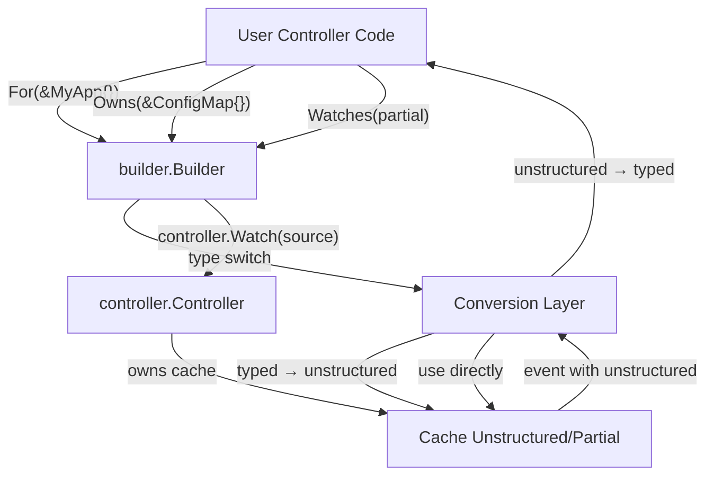
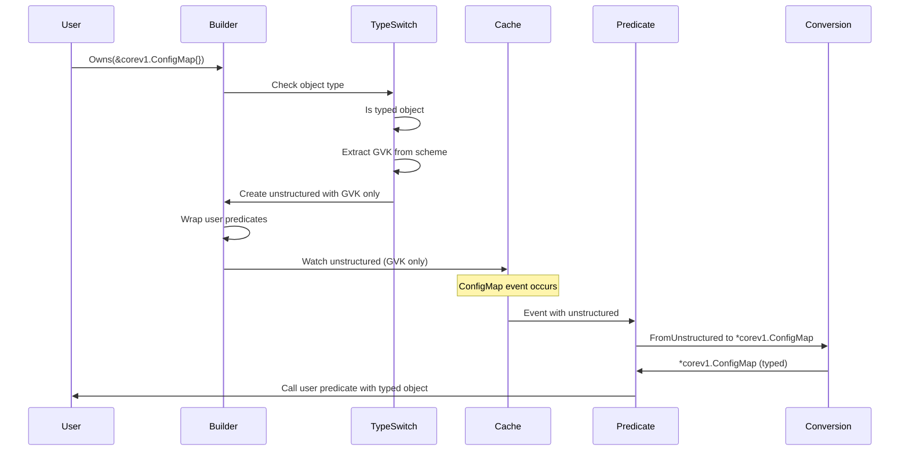

# Controller Builder Design

## Overview

The `pkg/builder` package provides a type-safe, generic controller builder that uses GVK-based watches with automatic type handling.

**Key Features:**
- Type-safe generic APIs with `For[T]()` for primary resources
- GVK-based `Owns()` and `Watches()` for secondary resources (zero conversion overhead)
- `WatchStrategy` enum (`WatchFull`, `WatchPartial`) for explicit watch configuration
- Automatic conversion when mappers/predicates expect typed objects
- Direct `controller.Watch()` calls instead of wrapping controller-runtime builder
- Compatible with existing Pipeline auto-watch system
- Performance optimization via partial metadata for metadata-only watches

## Motivation

### Problem Statement

When building Kubernetes controllers, developers face several challenges:

1. **Memory Overhead**: Controller caches store full objects (spec + status) even when only metadata is needed
2. **Type Safety vs Flexibility**: Typed objects provide safety but limit flexibility; unstructured provides flexibility but loses type safety
3. **Boilerplate**: Manual conversion between typed and unstructured objects is repetitive and error-prone
4. **Cache Efficiency**: No easy way to optimize memory by watching only metadata for certain resources

### Solution

Provide a builder that:
- Uses unstructured/partial types internally for efficient caching
- Provides type-safe APIs externally via generics
- Automatically converts between representations transparently
- Allows per-resource optimization (typed → unstructured → partial)

## Architecture

### High-Level Design



### Component Relationships

**Builder**
- Prepares builder - controller created in Complete()
- Each method call (`For`, `Owns`, `Watches`) queues watch configuration
- Type switches on object parameter to determine conversion strategy
- Wraps predicates/handlers with conversion logic when needed

**Conversion Layer**
- Wraps user predicates to convert unstructured → typed
- Wraps user handlers to convert unstructured → typed
- Uses existing `resources.FromUnstructured()` utilities
- Handles partial → typed conversion for metadata-only watches

**Controller & Cache**
- Standard controller-runtime controller
- Cache stores unstructured or partial objects (lower memory)
- Events flow through controller to wrapped predicates/handlers

## Design Decisions

### Decision 1: Direct controller.Watch() vs Wrapping builder.Builder

**Chosen:** Direct `controller.Watch()` calls

**Alternatives Considered:**

1. **Wrap controller-runtime builder** - Intercept `Owns()`, `Watches()` calls
2. **Direct controller.Watch()** - Create controller upfront, register watches directly

**Rationale:**

Direct `controller.Watch()` is simpler and more transparent:
- Fewer abstraction layers
- Complete control over watch registration
- Easier to understand and debug
- No dependency on builder internals
- More flexible for future enhancements

Controller-runtime's builder does exactly what we'd do anyway:
```go
// What builder.Owns() does under the hood:
src := source.Kind(cache, object, handler, predicates...)
controller.Watch(src)
```

We just do this ourselves with our conversion logic built in.

### Decision 2: GVK-Based API for Owns/Watches

**Chosen:** GVK-based API with typed `For()`

**API:**
```go
For(obj T, opts...)                      // Typed primary resource
Owns(gvk schema.GroupVersionKind, opts...)     // GVK-based secondary resource
Watches(gvk schema.GroupVersionKind, opts...)  // GVK-based custom watch
```

**Alternatives Considered:**

1. **Object instances** - `Owns(&corev1.ConfigMap{}, opts...)`
2. **Pure GVK** - `Owns(gvks.ConfigMap, opts...)`
3. **Mixed** - Accept both objects and GVKs

**Rationale:**

GVK-based API provides:
- **Zero conversion overhead** by default - watches use unstructured/partial directly
- **Explicit intent** - caller specifies exactly what to watch
- **Cleaner API** - no need for type switches or object instantiation
- **Consistent with controller-runtime patterns** - GVK is the natural identifier

The `pkg/resources/gvks` package provides common GVKs:
```go
builder.
    For(&v1.MyApp{}).                    // Typed primary resource
    Owns(gvks.ConfigMap).                // Uses unstructured (default)
    Owns(gvks.Secret, builder.AsPartial()).  // Uses partial metadata
    Watches(gvks.Pod,
        builder.WithMapper(podMapper),
    ).
    Complete(reconciler)
```

**WatchStrategy:**
- `WatchFull` (default): Uses `*unstructured.Unstructured`
- `WatchPartial`: Uses `*metav1.PartialObjectMetadata` (~70% memory reduction)

### Decision 3: Conversion Strategy

**Default:** Convert typed → unstructured

**Override:** `AsPartial()` option can only be used with unstructured/partial objects

**Rationale:**

Unstructured as default because:
- Works for all resource types
- Preserves full object data (spec + status)
- Controller-runtime cache handles unstructured efficiently
- Familiar to users working with dynamic clients

AsPartial() restrictions:
- Can **only** be used with `*unstructured.Unstructured` or `*metav1.PartialObjectMetadata`
- **Cannot** be used with typed objects (e.g., `&corev1.ConfigMap{}`)
- Reason: Converting partial metadata to typed objects results in incomplete data

Partial as opt-in because:
- Only contains metadata (labels, annotations, ownership)
- Lower memory footprint (~70% reduction)
- Faster for metadata-only operations
- Must be explicit choice (user understands trade-offs)

### Decision 4: When Conversion Happens

**Conversion Point:** Per-event in predicates/handlers

**Not:** Per-reconcile or during caching

**Rationale:**

Event-time conversion because:
- Cache stores unstructured/partial (memory efficient)
- Conversion only when predicate/handler needs typed object
- Failed conversions don't break reconciliation
- Conversion errors drop events silently (no logging overhead)

Trade-off analysis:
- **Pro:** Lower memory footprint in cache
- **Pro:** Conversion only when actually needed
- **Con:** CPU overhead per event (acceptable - predicates filter most events)
- **Con:** Conversion errors must be handled gracefully

## API Design

### Creating a Builder

```go
// Create builder - controller created later in Complete()
builder, err := builder.NewControllerBuilder[*v1.MyApp](
    mgr,
    builder.WithName("myapp-controller"),  // Optional - can be derived from For()
    builder.WithMaxConcurrentReconciles(3),
)
if err != nil {
    return err
}
```

**Parameters:**
- `mgr` - Controller manager (provides client, cache, scheme)
- `opts` - Optional controller configuration including:
  - `WithName(name)` - Controller name (optional, can be derived from For() object type)
  - `WithMaxConcurrentReconciles(n)` - Concurrent reconciliation limit
  - `WithRateLimiter(limiter)` - Custom rate limiter
  - `WithClient(client)` - Custom client instance
  - `WithCache(cache)` - Custom cache instance

**Returns:** Builder instance (controller created later in Complete())

### Registering Primary Resource

```go
// For() is type-safe - must match Builder[T]
builder.For(
    &v1.MyApp{},  // Type-checked at compile time against Builder[*v1.MyApp]
    builder.WithPredicates(myPredicate),
)
```

**What happens:**
1. Validates For() called exactly once
2. Derives controller name from object type if not set via `WithName()` (e.g., `*v1.MyApp` → "myapp")
3. Type switch detects typed object (`*v1.MyApp`)
4. Extracts GVK from typed object
5. Creates minimal `unstructured.Unstructured` with only GVK set
6. Wraps user predicates to convert unstructured → `*v1.MyApp`
7. Queues watch for registration in Complete()

**Type Safety:**
- For() signature: `func (b *Builder[T]) For(obj T, opts ...WatchOption)`
- Compile-time enforcement: `Builder[*v1.MyApp]` can only call `For(&v1.MyApp{})`
- Prevents type mismatches: `Builder[*MyApp].For(&ConfigMap{})` won't compile
- For unstructured primary resources, use `Builder[*unstructured.Unstructured]` or `Builder[client.Object]`

**Controller Name Derivation:**
- If `WithName("custom-name")` provided to `NewControllerBuilder()`, uses that name
- Otherwise, derives from object type: `*v1.MyApp` → "myapp", `*v1.FooBar` → "foobar"
- Name is converted to lowercase
- Validation in `Complete()` ensures name is set

**Result:** Watch queued for MyApp resources with unstructured cache

**Note:** Only the GVK is needed for watch setup. The cache stores actual objects from the API server, not our sample object. Watch registration happens in Complete().

### Registering Owned Resources

#### Function-Based Configuration

```go
// Example 1: GVK with default strategy (WatchFull - unstructured)
builder.Owns(gvks.ConfigMap)

// Example 2: GVK with WatchPartial (memory efficient)
builder.Owns(gvks.Deployment, builder.AsPartial())

// Example 3: GVK with custom predicates
builder.Owns(gvks.Secret, 
    builder.WithPredicates(predicates.LabelChanged()),
)
```

**Default Handler:** `handler.EnqueueRequestForOwner` (reconciles owner via OwnerReference)

**Custom Handlers:**
```go
builder.Owns(
    gvks.ConfigMap,
    builder.WithHandler(myHandler),
    builder.WithPredicates(predicates.LabelChanged()),
)
```

#### Struct-Based Configuration

Equivalent examples using struct-based options:

```go
// Example 1: GVK with custom handler and predicates
builder.Owns(gvks.ConfigMap, &builder.WatchOptions{
    Handler: myHandler,
    Predicates: []predicate.Predicate{
        predicates.LabelChanged(),
    },
})

// Example 2: GVK with WatchPartial
builder.Owns(gvks.Deployment, &builder.WatchOptions{
    Strategy: builder.WatchPartial,
    Predicates: []predicate.Predicate{
        predicates.GenerationChanged(),
    },
})
```

**Note:** Both configuration styles can be mixed in the same controller. Choose the style that best fits each watch's needs.

### Registering Custom Watches

#### Function-Based Configuration

```go
// GVK with unstructured mapper (zero conversion)
builder.Watches(
    gvks.Secret,
    builder.WithMapper(func(
        ctx context.Context,
        u *unstructured.Unstructured,
    ) []reconcile.Request {
        secretType, _, _ := unstructured.NestedString(u.Object, "type")
        if secretType == string(corev1.SecretTypeTLS) {
            return []reconcile.Request{{
                NamespacedName: types.NamespacedName{
                    Name: "tls-ingress",
                    Namespace: u.GetNamespace(),
                },
            }}
        }
        return nil
    }),
)

// GVK with typed mapper (automatic conversion)
builder.Watches(
    gvks.Secret,
    builder.WithMapper(func(
        ctx context.Context,
        secret *corev1.Secret,  // Automatic conversion from unstructured
    ) []reconcile.Request {
        if secret.Type == corev1.SecretTypeTLS {
            return []reconcile.Request{{
                NamespacedName: types.NamespacedName{
                    Name: "tls-ingress",
                    Namespace: secret.Namespace,
                },
            }}
        }
        return nil
    }),
)

// Or use WithHandler for full control
builder.Watches(
    gvks.Secret,
    builder.WithHandler(myCustomHandler),
)
```

#### Mapper Type Compatibility

The mapper's generic type determines if conversion is needed:

| Mapper Type | Strategy | Result |
|-------------|----------|--------|
| `*unstructured.Unstructured` | `WatchFull` | ✓ Zero conversion |
| `*metav1.PartialObjectMetadata` | `WatchPartial` | ✓ Zero conversion |
| `client.Object` | Any | ✓ Zero conversion |
| `*corev1.Secret` (typed) | `WatchFull` | ✓ Automatic conversion |
| `*corev1.Secret` (typed) | `WatchPartial` | ✗ Error (partial lacks data) |
| `*unstructured.Unstructured` | `WatchPartial` | ✗ Error (type mismatch) |
| `*metav1.PartialObjectMetadata` | `WatchFull` | ✗ Error (type mismatch) |

Validation happens at registration time with clear error messages.

#### Struct-Based Configuration

```go
// Custom handler with multiple predicates
builder.Watches(gvks.Pod, &builder.WatchOptions{
    Handler: myCustomHandler,
    Predicates: []predicate.Predicate{
        predicates.GenerationChanged(),
        predicates.ResourceVersionChanged(),
    },
    Strategy: builder.WatchPartial,  // Memory optimization
})
```

### Completing Setup

```go
err := builder.Complete(reconciler)
if err != nil {
    return err
}
```

**What happens:**
1. Validates For() was called and controller name is set
2. Wraps reconciler with `reconciler.AsReconciler()` for object fetching and context injection
3. Creates `controller.Controller` with the wrapped reconciler
4. Optionally injects controller and/or client if reconciler implements `ControllerAware`/`ClientAware`
5. Registers all queued watches with the controller
6. Returns any accumulated errors

**Note:** Controller is created here with all watches registered immediately after

## Configuration Patterns

The builder supports two configuration patterns for `Owns()` and `Watches()` methods, following the library's `util.Option[T]` convention.

### Function-Based Options (Recommended)

Function-based options provide a fluent, discoverable API:

```go
builder.Owns(
    &corev1.ConfigMap{},
    builder.WithHandler(myHandler),
    builder.WithPredicates(predicates.LabelChanged()),
    builder.AsPartial(),
)
```

**Available Functions:**
- `WithHandler(handler)` - Custom event handler (replaces default handler)
- `WithMapper(mapper)` - Typed mapper (for `Watches()` only)
- `WithPredicates(predicates...)` - Filter events before reconciliation (additive across multiple calls)
- `AsPartial()` - Use partial metadata instead of full object (memory optimization)

**AsPartial() Restrictions:**
- `AsPartial()` can **only** be used with untyped objects (`*unstructured.Unstructured`, `*metav1.PartialObjectMetadata`)
- Cannot be used with typed objects (e.g., `&corev1.ConfigMap{}`)
- Reason: Converting partial metadata to typed objects results in incomplete data (spec/status/data fields would be empty)
- If you need to inspect non-metadata fields in predicates/handlers, don't use `AsPartial()`
- Error message: `"AsPartial() cannot be used with typed object: partial metadata conversion results in incomplete data"`

**Note:** `AsPartial()` takes no parameters and sets the flag to true. To disable partial metadata when overriding struct options, use a new `WatchOptions` struct with `AsPartial: false`.

**Benefits:**
- Clear intent and IDE autocomplete
- Easy to compose optional configuration
- Fluent method chaining

### Struct-Based Options (Alternative)

Struct-based options are useful when configuring many options at once or passing pre-configured option sets:

```go
builder.Owns(&corev1.ConfigMap{}, builder.WatchOptions{
    Handler: myHandler,
    Predicates: []predicate.Predicate{
        predicates.LabelChanged(),
        predicates.GenerationChanged(),
    },
    AsPartial: true,
})
```

**WatchOptions Struct:**
```go
type WatchOptions struct {
    Handler    handler.EventHandler    // Custom event handler
    Predicates []predicate.Predicate   // Event filters
    Strategy   WatchStrategy           // WatchFull (default) or WatchPartial
}

// WatchStrategy determines how objects are watched
type WatchStrategy int

const (
    WatchFull    WatchStrategy = iota  // *unstructured.Unstructured (default)
    WatchPartial                       // *metav1.PartialObjectMetadata
)
```

**Note:** Mappers must be configured via `WithMapper[O]()` function for type safety. The mapper factory is stored internally and not directly accessible.

**Benefits:**
- Compact for multi-option configuration
- Easy to pass around and validate
- Natural for configuration from files/environment

### Hybrid Approach

Both patterns can be mixed in the same configuration:

```go
// Pre-configure base options
baseOpts := builder.WatchOptions{
    Predicates: []predicate.Predicate{
        predicates.GenerationChanged(),
    },
}

// Add additional options via functions
builder.Owns(
    &corev1.ConfigMap{},
    baseOpts,
    builder.WithHandler(myHandler),  // Add handler via function
)
```

### Precedence Rules

These rules are intentionally explicit so an AI agent can reason about behavior:
- For `Watches()`, `WithMapper()` and `WithHandler()` are mutually exclusive; providing both is a configuration error.
- When both struct options and function options are provided, function options override struct fields.
- Multiple `WithPredicates()` calls are additive (concatenate in order).
- `AsPartial()` overrides any struct `AsPartial` value.

### When to Use Each

**Use Function-Based when:**
- Setting one or two options
- Building fluent method chains
- Prefer explicit, self-documenting code

**Use Struct-Based when:**
- Configuring many options (3+)
- Passing option sets between functions
- Loading configuration from external sources
- Sharing common configurations across multiple watches

**Use Hybrid when:**
- You have base configurations to reuse
- Want to override specific options from a base config
- Building configuration progressively

### Examples

**Function-Based Example:**
```go
func SetupWithManager(mgr ctrl.Manager) error {
    b, _ := builder.NewControllerBuilder[*v1.MyApp](mgr, "myapp")
    
    return b.
        For(&v1.MyApp{}).
        Owns(&corev1.ConfigMap{},
            builder.WithPredicates(predicates.GenerationChanged()),
        ).
        Owns(&corev1.Secret{},
            builder.WithHandler(customHandler),
        ).
        Complete(reconciler.Wrap(myReconciler))
}
```

**Struct-Based Example:**
```go
func SetupWithManager(mgr ctrl.Manager) error {
    b, _ := builder.NewControllerBuilder[*v1.MyApp](mgr, "myapp")
    
    // Pre-configure common options
    strictWatch := builder.WatchOptions{
        Predicates: []predicate.Predicate{
            predicates.GenerationChanged(),
            predicates.ResourceVersionChanged(),
        },
    }
    
    return b.
        For(&v1.MyApp{}).
        Owns(&corev1.ConfigMap{}, strictWatch).
        Owns(&corev1.Secret{}, strictWatch).
        Complete(reconciler.Wrap(myReconciler))
}
```

**Hybrid Example:**
```go
func SetupWithManager(mgr ctrl.Manager) error {
    b, _ := builder.NewControllerBuilder[*v1.MyApp](mgr, "myapp")
    
    // Base configuration for all owned resources
    baseOpts := builder.WatchOptions{
        Predicates: []predicate.Predicate{
            predicates.GenerationChanged(),
        },
        AsPartial: true,  // Memory optimization
    }
    
    return b.
        For(&v1.MyApp{}).
        // ConfigMap: use base options as-is
        Owns(&corev1.ConfigMap{}, baseOpts).
        // Secret: add custom handler to base options
        Owns(&corev1.Secret{},
            baseOpts,
            builder.WithHandler(secretHandler),
        ).
        // Deployment: use full object (override AsPartial from baseOpts)
        Owns(&appsv1.Deployment{}, builder.WatchOptions{
            Predicates: baseOpts.Predicates,
            AsPartial: false,  // Override via struct field
        }).
        Complete(reconciler.Wrap(myReconciler))
}
```

## Behavior Matrix

This matrix is meant as a compact, unambiguous reference for AI agents.

### For() - Primary Resource (Typed)

| Input | Strategy | Watch Object | Conversion |
|-------|----------|--------------|------------|
| `&v1.MyApp{}` | N/A | `*unstructured.Unstructured` | predicate/handler event |

### Owns()/Watches() - Secondary Resources (GVK-based)

| Strategy | Watch Object | Mapper/Predicate Type | Result |
|----------|--------------|----------------------|--------|
| `WatchFull` (default) | `*unstructured.Unstructured` | `*unstructured.Unstructured` | ✓ Zero conversion |
| `WatchFull` | `*unstructured.Unstructured` | `client.Object` | ✓ Zero conversion |
| `WatchFull` | `*unstructured.Unstructured` | Typed (e.g., `*corev1.Pod`) | ✓ Automatic conversion |
| `WatchPartial` | `*metav1.PartialObjectMetadata` | `*metav1.PartialObjectMetadata` | ✓ Zero conversion |
| `WatchPartial` | `*metav1.PartialObjectMetadata` | `client.Object` | ✓ Zero conversion |
| `WatchFull` | `*unstructured.Unstructured` | `*metav1.PartialObjectMetadata` | ✗ Error |
| `WatchPartial` | `*metav1.PartialObjectMetadata` | `*unstructured.Unstructured` | ✗ Error |
| `WatchPartial` | `*metav1.PartialObjectMetadata` | Typed | ✗ Error (partial lacks data) |

### GVK Validation

GVKs are validated at registration time:
- **Kind required:** `Owns(schema.GroupVersionKind{Version: "v1"})` → Error: "GVK must have a Kind"
- **Version required:** `Owns(schema.GroupVersionKind{Kind: "Pod"})` → Error: "GVK must have a Version"
- **Group optional:** Empty group is valid for core resources (e.g., v1/Pod)

Notes:
- For `Watches()`, `WithMapper()` and `WithHandler()` are mutually exclusive; providing both is an error.
- Mapper/predicate type validation happens at registration time with clear error messages.

## Non-goals

This design does not attempt to solve:
- Typed caches or typed informer wiring
- Dynamic GVK discovery without a scheme
- Automatic conversion caching across predicates/handlers
- Rewriting controller-runtime builder internals

## Type Conversion Details

### Conversion Flow



### Type Switch Logic

```go
switch v := any(obj).(type) {
case *unstructured.Unstructured:
    // Use directly - no deep copy needed, just copy GVK
    watchObj = &unstructured.Unstructured{}
    watchObj.SetGroupVersionKind(v.GroupVersionKind())
    needsConversion = false
    
case *metav1.PartialObjectMetadata:
    // Use directly - just copy GVK
    partial := &metav1.PartialObjectMetadata{}
    partial.SetGroupVersionKind(v.GroupVersionKind())
    watchObj = partial
    needsConversion = false
    
default:
    // Typed object - just extract GVK and create unstructured
    gvk, err := apiutil.GVKForObject(obj, scheme)
    if err != nil {
        return err
    }
    
    // Create minimal unstructured with only GVK
    u := &unstructured.Unstructured{}
    u.SetGroupVersionKind(gvk)
    watchObj = u
    needsConversion = true
}
```

**Optimization Note:** We only need the GVK to set up the watch. The cache will store actual unstructured objects from the API server, not the sample object we pass to `source.Kind()`. This avoids unnecessary conversion overhead during watch setup.

### Predicate Wrapping

When `needsConversion == true`, predicates are wrapped:

```go
// User predicate works with typed objects
userPredicate := predicate.TypedFuncs[*corev1.ConfigMap]{
    UpdateFunc: func(e event.TypedUpdateEvent[*corev1.ConfigMap]) bool {
        // e.ObjectOld and e.ObjectNew are *corev1.ConfigMap
        return e.ObjectNew.Data["key"] != e.ObjectOld.Data["key"]
    },
}

// Wrapped predicate works with unstructured
wrappedPredicate := wrapTypedPredicate(scheme, userPredicate)
// Now handles unstructured events, converts to typed, calls user predicate
```

### Handler Wrapping

Similar wrapping for handlers:

```go
// User handler with typed objects
userHandler := handler.TypedFuncs[*corev1.ConfigMap, reconcile.Request]{
    CreateFunc: func(
        ctx context.Context,
        e event.TypedCreateEvent[*corev1.ConfigMap],
        q workqueue.RateLimitingInterface,
    ) {
        // e.Object is *corev1.ConfigMap
        cm := e.Object
        // ... use typed fields ...
    },
}

// Wrapped handler converts unstructured → typed
wrappedHandler := wrapTypedHandler(scheme, userHandler)
```

### Conversion Error Handling

Conversion failures are handled predictably and without side effects:

```go
typedObj, err := convertToTyped[T](scheme, unstructuredObj)
if err != nil {
    // Drop event silently
    return false
}
```

**Predicate behavior:**
- Conversion failure returns `false` for that predicate evaluation
- The event is dropped at the predicate stage (no handler invocation)

**Handler behavior:**
- Conversion failure returns without enqueueing
- No automatic requeue; the event is effectively dropped

**Impact:**
- Conversion errors do not crash the controller
- Events are silently dropped (no logging overhead)
- User predicates/handlers never see invalid typed objects

## Performance Considerations

### Memory Usage

**Typed vs Unstructured vs Partial:**

```
Deployment object memory usage:
- Typed (*appsv1.Deployment):           ~2.5 KB
- Unstructured (with full spec/status): ~2.5 KB (similar)
- Partial (metadata only):              ~0.8 KB (70% reduction)
```

**Recommendation:**
- Use typed/unstructured for resources that need spec/status access
- Use partial for metadata-only watches (labels, annotations, ownership)

### CPU Overhead

**Watch Setup Cost:**

Minimal overhead during watch setup:
- Typed objects: Extract GVK from scheme (~10 microseconds)
- Unstructured/partial: Copy GVK only (~1 microsecond)
- No full object conversion during setup
- Setup happens once per watch, not per event

**Event Conversion Cost:**

Per-event conversion: ~50-100 microseconds
- Only happens when predicates/handlers need typed objects
- Negligible compared to reconciliation time (~milliseconds)
- Only happens when predicates need to run
- Most events filtered before reaching handlers

**Mapper Invocation:**

Mappers created via `WithMapper[O]()` use type assertions instead of reflection:
- Type assertion: ~1-5 nanoseconds
- No `reflect.Call()` overhead during event processing
- Mapper signature validated at compile time, not runtime

**Optimization:**

If no conversion needed (passed unstructured/partial), zero event overhead:
```go
// Zero conversion overhead at watch setup and event time
builder.Owns(&unstructured.Unstructured{...})  // Just copy GVK
builder.Owns(partialObj)                       // Just copy GVK
```

### Cache Efficiency

**Internal Cache:**

Controller-runtime cache stores objects by GVK:
- Typed objects: Stored with reflection overhead
- Unstructured: Stored as `map[string]interface{}`
- Partial: Stored with only metadata fields

**Benefits:**
- Unstructured cache works across all resource types
- No scheme registration required for dynamic resources
- Partial cache reduces memory by ~70% for metadata-only watches

## Integration with Existing Systems

### Pipeline Auto-Watch

Builder and Pipeline auto-watch can coexist:

```go
// Static watches via builder
b, _ := builder.NewControllerBuilder[*v1.MyApp](
    mgr,
    builder.WithName("myapp"),
)

b.For(&v1.MyApp{}).
    Owns(&corev1.ConfigMap{}).  // Static watch
    Complete(reconciler)

// After Complete(), controller is created and watches are registered
// Dynamic watches via Pipeline post-apply hook
w := watch.New(watch.WithClient(mgr.GetClient()), watch.WithController(ctrl), watch.WithCache(mgr.GetCache()))
pipeline, _ := pipeline.NewPipeline(
    mgr.GetClient(),
    pipeline.WithPostApply(w.Watch),
)
```

**Use Cases:**
- **Builder:** Static watches known at controller creation
- **Auto-watch:** Dynamic watches based on reconciliation output

**Both systems:**
- Register watches with same controller
- Use same cache
- Share predicates patterns
- Work independently without conflicts

### Existing Predicates

Library predicates work with both typed and unstructured:

```go
// These work regardless of underlying type
builder.Owns(
    &corev1.ConfigMap{},
    builder.WithPredicates(
        predicates.GenerationChanged(),
        predicates.LabelChanged(),
    ),
)
```

**Note:** Predicates from `pkg/predicates` operate on `client.Object` interface, so they work with typed, unstructured, or partial objects after conversion.

### Existing Handlers

Standard controller-runtime handlers work after conversion:

```go
// EnqueueRequestForOwner works with any object type
builder.Owns(&corev1.ConfigMap{})  // Uses default owner handler

// Custom typed handlers
builder.Owns(
    &corev1.Secret{},
    builder.WithHandler(myTypedHandler),
)
```

## Usage Examples

### Example 1: Simple Controller

```go
package controller

import (
    "context"
    
    ctrl "sigs.k8s.io/controller-runtime"
    "sigs.k8s.io/controller-runtime/pkg/reconcile"
    
    v1 "github.com/example/api/v1"
    "github.com/lburgazzoli/k8s-controller-lib/pkg/builder"
    "github.com/lburgazzoli/k8s-controller-lib/pkg/predicates"
    "github.com/lburgazzoli/k8s-controller-lib/pkg/resources/gvks"
)

func SetupWithManager(mgr ctrl.Manager) error {
    b, err := builder.NewControllerBuilder[*v1.MyApp](
        mgr,
        builder.WithName("myapp-controller"),
    )
    if err != nil {
        return err
    }
    
    return b.
        For(&v1.MyApp{}).
        Owns(gvks.ConfigMap,
            builder.WithPredicates(predicates.GenerationChanged()),
        ).
        Owns(gvks.Secret).
        Complete(&MyAppReconciler{})
}

type MyAppReconciler struct {
    client.Client
}

func (r *MyAppReconciler) Reconcile(
    ctx context.Context,
    obj *v1.MyApp,
) (reconcile.Result, error) {
    // Reconcile logic
    return reconcile.Result{}, nil
}
```

### Example 2: Mixed Watch Strategies

```go
func SetupWithManager(mgr ctrl.Manager) error {
    b, err := builder.NewControllerBuilder[*v1.MyApp](
        mgr,
        builder.WithName("myapp"),
    )
    if err != nil {
        return err
    }
    
    // Custom GVK for custom resources
    customGVK := schema.GroupVersionKind{
        Group: "custom.io", Version: "v1", Kind: "CustomThing",
    }
    
    return b.
        For(&v1.MyApp{}).
        Owns(gvks.ConfigMap).               // WatchFull (default)
        Owns(gvks.Deployment,               // WatchPartial (memory efficient)
            builder.AsPartial(),
            builder.WithPredicates(predicates.LabelChanged()),
        ).
        Owns(customGVK).                    // Custom resource
        Complete(reconciler.Wrap(myReconciler))
}
```

### Example 3: Custom Mappers and Handlers

```go
func SetupWithManager(mgr ctrl.Manager) error {
    b, err := builder.NewControllerBuilder[*v1.MyApp](
        mgr,
        builder.WithName("myapp"),
    )
    if err != nil {
        return err
    }
    
    // Zero-conversion mapper (unstructured)
    secretMapper := func(ctx context.Context, u *unstructured.Unstructured) []reconcile.Request {
        if owner, ok := u.GetLabels()["app"]; ok {
            return []reconcile.Request{{
                NamespacedName: types.NamespacedName{
                    Name: owner,
                    Namespace: u.GetNamespace(),
                },
            }}
        }
        return nil
    }
    
    // Or typed mapper with automatic conversion
    typedSecretMapper := func(ctx context.Context, secret *corev1.Secret) []reconcile.Request {
        // secret is automatically converted from unstructured
        if owner, ok := secret.Labels["app"]; ok {
            return []reconcile.Request{{
                NamespacedName: types.NamespacedName{
                    Name: owner,
                    Namespace: secret.Namespace,
                },
            }}
        }
        return nil
    }
    
    return b.
        For(&v1.MyApp{}).
        Watches(
            gvks.Secret,
            builder.WithMapper(secretMapper),  // Zero conversion
        ).
        // Or with typed mapper:
        // builder.WithMapper(typedSecretMapper),  // Auto conversion
        Complete(reconciler.Wrap(myReconciler))
}
```

### Example 4: Optimized for Memory

```go
func SetupWithManager(mgr ctrl.Manager) error {
    b, err := builder.NewControllerBuilder[*v1.MyApp](
        mgr,
        builder.WithName("myapp"),
    )
    if err != nil {
        return err
    }
    
    // Only care about labels/annotations - use WatchPartial
    return b.
        For(&v1.MyApp{}).
        Owns(gvks.ConfigMap, builder.AsPartial()).
        Owns(gvks.Secret, builder.AsPartial()).
        Owns(gvks.Deployment, builder.AsPartial()).
        Complete(reconciler.Wrap(myReconciler))
    
    // Result: ~70% memory reduction in cache
}
```

### Example 5: Struct-Based Configuration

```go
func SetupWithManager(mgr ctrl.Manager) error {
    b, err := builder.NewControllerBuilder[*v1.MyApp](
        mgr,
        builder.WithName("myapp"),
    )
    if err != nil {
        return err
    }
    
    // Define reusable option sets
    strictWatch := builder.WatchOptions{
        Predicates: []predicate.Predicate{
            predicates.GenerationChanged(),
            predicates.ResourceVersionChanged(),
        },
    }
    
    partialWatch := builder.WatchOptions{
        AsPartial: true,
        Predicates: []predicate.Predicate{
            predicates.LabelChanged(),
        },
    }
    
    // Custom mapper for Secrets
    secretMapper := func(ctx context.Context, secret *corev1.Secret) []reconcile.Request {
        // Only reconcile for TLS secrets
        if secret.Type != corev1.SecretTypeTLS {
            return nil
        }
        
        // Map to owner from label
        if owner, ok := secret.Labels["app"]; ok {
            return []reconcile.Request{{
                NamespacedName: types.NamespacedName{
                    Name: owner,
                    Namespace: secret.Namespace,
                },
            }}
        }
        return nil
    }
    
    return b.
        For(&v1.MyApp{}).
        // ConfigMaps: strict validation
        Owns(&corev1.ConfigMap{}, strictWatch).
        // Secrets: custom mapper (must use WithMapper for type safety)
        Watches(&corev1.Secret{},
            builder.WithMapper(secretMapper),
            builder.AsPartial(),
        ).
        // Deployments: partial metadata with label watching
        Owns(&appsv1.Deployment{}, partialWatch).
        // Services: mix struct and function options
        Owns(&corev1.Service{},
            partialWatch,
            builder.WithHandler(customServiceHandler),  // Override with custom handler
        ).
        Complete(reconciler.Wrap(myReconciler))
}
```

**When to use this approach:**
- You have many watches with similar configurations
- You want to share option sets across multiple controllers
- Configuration is loaded from external sources
- You need to override specific options from a base configuration

## Error Scenarios

This section documents common error scenarios to help with debugging.

### Error 1: AsPartial with Typed Object

**Invalid Configuration:**
```go
b.Owns(&corev1.ConfigMap{}, builder.AsPartial())
```

**Error:**
```
failed to register watches: [AsPartial() cannot be used with typed object *v1.ConfigMap:
partial metadata conversion to typed objects results in incomplete data.
Use *unstructured.Unstructured or *metav1.PartialObjectMetadata instead]
```

**Correct Usage:**
```go
// Option 1: Use unstructured
u := &unstructured.Unstructured{}
u.SetGroupVersionKind(schema.GroupVersionKind{
    Group: "", Version: "v1", Kind: "ConfigMap",
})
b.Owns(u, builder.AsPartial())

// Option 2: Use partial metadata
p := &metav1.PartialObjectMetadata{}
p.SetGroupVersionKind(schema.GroupVersionKind{
    Group: "", Version: "v1", Kind: "ConfigMap",
})
b.Owns(p)
```

### Error 2: Type Not in Scheme (Runtime)

**Scenario:** Watching a custom resource not registered in the scheme.

```go
u := &unstructured.Unstructured{}
u.SetGroupVersionKind(schema.GroupVersionKind{
    Group: "example.com", Version: "v1", Kind: "CustomResource",
})

b.Owns(u)  // Registers successfully during Complete()
```

**Runtime Behavior:**
- Events for this GVK arrive at the watch
- Conversion fails: "no kind is registered for type"
- Events silently dropped (predicate returns false)
- Metric `builder_conversion_errors_total{controller="mycontroller",reason="type_not_in_scheme"}` incremented

**How to Debug:**
```bash
# Check conversion error metrics
kubectl port-forward <controller-pod> 8080:8080
curl localhost:8080/metrics | grep builder_conversion_errors_total

# Expected output if conversions failing:
# builder_conversion_errors_total{controller="mycontroller",api_version="example.com/v1",kind="CustomResource",reason="type_not_in_scheme"} 15
```

### Error 3: Mapper Signature Mismatch (Compile-Time)

**Invalid Mapper:**
```go
// Wrong: returns error instead of []reconcile.Request
mapper := func(ctx context.Context, obj *corev1.Secret) error {
    return nil
}

b.Watches(&corev1.Secret{}, builder.WithMapper(mapper))
```

**Compile Error:**
```
cannot use mapper (variable of type func(context.Context, *v1.Secret) error) as
func(context.Context, *v1.Secret) []reconcile.Request value in argument to builder.WithMapper
```

**Note:** Mapper signatures are validated at compile time via Go generics. The `WithMapper[O]()` function requires the exact signature `func(context.Context, O) []reconcile.Request`. Invalid signatures will not compile.

**Correct Usage:**
```go
mapper := func(ctx context.Context, secret *corev1.Secret) []reconcile.Request {
    return []reconcile.Request{{
        NamespacedName: types.NamespacedName{
            Name: secret.Labels["owner"],
            Namespace: secret.Namespace,
        },
    }}
}

b.Watches(&corev1.Secret{}, builder.WithMapper(mapper))
```

## Conversion Error Handling

### When Conversion Can Fail

Conversion from unstructured to typed objects can fail in these scenarios:

1. **Type not registered in scheme**
   - The object's GVK is not registered via `scheme.AddKnownTypes()`
   - Most common when watching custom resources without adding them to scheme
   - Error: `"no kind is registered for type <GVK>"`

2. **Invalid unstructured data**
   - The unstructured object contains malformed data
   - Type conversion fails (e.g., string where int expected)
   - Error: `"failed to convert from unstructured: ..."`

3. **Type assertion failure**
   - Created object doesn't implement `client.Object` interface
   - Rare - indicates scheme misconfiguration
   - Error: `"target type %T does not implement client.Object"`

### Observable Behavior

**Predicates:**
- Conversion failure → predicate receives no event → returns `false`
- Event is dropped before reaching user predicate code

**Handlers:**
- Conversion failure → handler not invoked
- No reconcile request enqueued

**Metrics:**
```prometheus
# Total conversion errors by controller, api_version, kind, and reason
builder_conversion_errors_total{controller="mycontroller",api_version="apps/v1",kind="Deployment",reason="type_not_in_scheme"} 5
builder_conversion_errors_total{controller="mycontroller",api_version="v1",kind="ConfigMap",reason="conversion_failed"} 2
```

**Logging:**
- No logging by default (performance consideration)
- Events are silently dropped
- Use metrics to detect conversion issues in production

### Debugging Conversion Failures

1. **Check metrics endpoint:**
   ```bash
   curl http://controller:8080/metrics | grep builder_conversion_errors_total
   ```

2. **Verify type is in scheme:**
   ```go
   gvk := schema.GroupVersionKind{Group: "example.com", Version: "v1", Kind: "MyType"}
   _, err := scheme.New(gvk)
   // If err != nil, type not registered
   ```

3. **Common fixes:**
   - Add custom resource to scheme before creating builder
   - Use `*unstructured.Unstructured` instead of typed objects
   - Register GVK via `scheme.AddKnownTypes()`

## Migration Guide

### From controller-runtime builder

**Before:**
```go
import (
    ctrl "sigs.k8s.io/controller-runtime"
    "sigs.k8s.io/controller-runtime/pkg/builder"
)

func SetupWithManager(mgr ctrl.Manager) error {
    return ctrl.NewControllerManagedBy(mgr).
        For(&v1.MyApp{}).
        Owns(&corev1.ConfigMap{}).
        Complete(&MyAppReconciler{})
}
```

**After:**
```go
import (
    "github.com/lburgazzoli/k8s-controller-lib/pkg/builder"
)

func SetupWithManager(mgr ctrl.Manager) error {
    b, err := builder.NewControllerBuilder[*v1.MyApp](
        mgr,
        "myapp-controller",
    )
    if err != nil {
        return err
    }
    
    return b.
        For(&v1.MyApp{}).
        Owns(&corev1.ConfigMap{}).
        Complete(&MyAppReconciler{})
}
```

**Key Differences:**
1. Import from `pkg/builder` instead of controller-runtime
2. Create builder with `NewControllerBuilder[T]()` (requires controller name)
3. Pass object instances to methods: `For(&v1.MyApp{})` not `For(&v1.MyApp{})`
4. Use `reconcile.TypedReconciler[T]` interface

**Benefits:**
- Unstructured cache (lower memory)
- Option to use partial metadata per resource
- Type-safe predicates and handlers
- Compatible with Pipeline auto-watch

## Future Enhancements

### Additional Metrics

Current metrics track conversion errors with `builder_conversion_errors_total{controller, api_version, kind, reason}`.

Potential additional metrics for conversion operations:
- `builder_conversion_total{controller, api_version, kind, success}` - Track successful conversions
- `builder_conversion_duration_seconds{controller, api_version, kind}` - Conversion latency

### Conversion Caching

Cache converted objects per-event to avoid duplicate conversions:
- Predicate converts once, handler reuses
- Cleared after event processing
- Configurable cache size

### Batch Conversion

For UPDATE events with many watches:
- Convert once, distribute to all predicates
- Reduces CPU overhead
- Requires coordination between watches

### Schema Validation

Optional validation of converted objects:
- Verify converted object matches expected schema
- Catch incompatible type conversions early
- Configurable via option

## References

- [Controller-Runtime Builder](https://pkg.go.dev/sigs.k8s.io/controller-runtime/pkg/builder)
- [Unstructured Objects](https://pkg.go.dev/k8s.io/apimachinery/pkg/apis/meta/v1/unstructured)
- [PartialObjectMetadata](https://pkg.go.dev/k8s.io/apimachinery/pkg/apis/meta/v1#PartialObjectMetadata)
- [Auto-Watch Design](./auto-watch.md)
- [Architecture Overview](../architecture.md)
