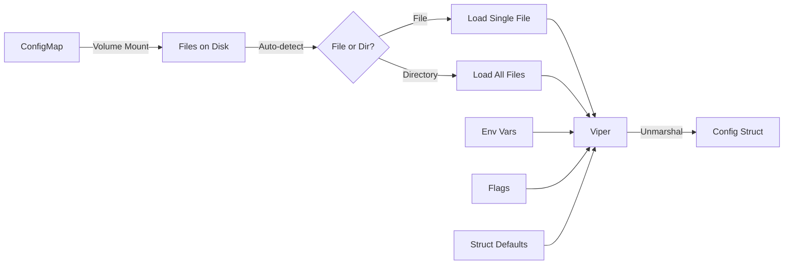

# Configuration Utility

A flexible configuration management system for Kubernetes controllers using Viper with support for multiple configuration sources, ConfigMap integration, and type-safe defaults.

## Overview

The configuration utility provides a layered configuration system that merges settings from multiple sources with clear precedence rules. It's designed for Kubernetes controllers that need flexible configuration through command-line flags, environment variables, and ConfigMap-backed volumes.

**Key features:**
- Multiple configuration sources with defined precedence
- Type-safe configuration using Go structs with defaults
- ConfigMap integration with automatic file/directory detection
- Functional options pattern for customization
- Support for both structured (YAML/JSON/TOML) and simple key-value configurations

**Use cases:**
- Controller feature flags
- Runtime behavior configuration
- Environment-specific settings
- Multi-tenant controller configurations with different prefixes

## Architecture

### Configuration Sources and Precedence

Configuration values are merged from multiple sources in order of priority (highest to lowest):

```
┌─────────────────────────────┐
│   1. Command-line Flags     │  ← Highest priority
├─────────────────────────────┤
│   2. Environment Variables  │
├─────────────────────────────┤
│   3. Configuration Files    │
│      (ConfigMap-backed)     │
├─────────────────────────────┤
│   4. Struct Defaults        │  ← Lowest priority
└─────────────────────────────┘
```

**Precedence rules:**
1. **Flags** override everything - for operational overrides (e.g., debugging)
2. **Environment variables** override config files - for deployment-specific settings
3. **Configuration files** override defaults - for persistent configuration
4. **Struct defaults** provide fallback values - for safe operation

### Data Flow



**Flow explanation:**
1. ConfigMap keys are projected as files in a mounted volume
2. Loader detects if path is a file or directory
3. Viper reads and merges all configuration sources
4. Final configuration is unmarshaled into a typed struct

## API Reference

### Core Types

```go
package config

import (
    "github.com/lburgazzoli/k8s-controller-lib/pkg/util"
    "github.com/spf13/pflag"
)

// LoaderOption is a type alias for configuration options
type LoaderOption = util.Option[LoaderOptions]

// LoaderOptions configures the configuration loader behavior
type LoaderOptions struct {
    // EnvPrefix is the prefix for environment variables
    // Default: "CONTROLLER"
    // Example: "MYAPP" results in MYAPP_FEATURE_FLAGS_ENABLED
    EnvPrefix string
    
    // ConfigPathEnvVar is the environment variable name that contains
    // the path to configuration file or directory
    // Default: "CONTROLLER_CONFIGURATION_PATH"
    ConfigPathEnvVar string
    
    // AutomaticEnv enables automatic environment variable binding
    // Default: true
    AutomaticEnv bool
}

// Loader manages configuration loading from multiple sources
type Loader struct {
    // internal fields
}

// NewLoader creates a new configuration loader with the given options
func NewLoader(opts ...LoaderOption) *Loader

// BindFlags binds the given flag set to the loader
// Call this before flag.Parse() to allow flags to override config
func (l *Loader) BindFlags(flags *pflag.FlagSet)

// Load reads configuration from all sources and unmarshals into cfg
// cfg must be a pointer to a struct with mapstructure tags
func (l *Loader) Load(cfg interface{}) error
```

### Option Functions

```go
// WithEnvPrefix sets the prefix for environment variables
// Example: WithEnvPrefix("MYAPP") → MYAPP_CONFIG_KEY
func WithEnvPrefix(prefix string) LoaderOption

// WithConfigPathEnvVar sets the environment variable name for config path
// Example: WithConfigPathEnvVar("MYAPP_CONFIG") 
func WithConfigPathEnvVar(envVar string) LoaderOption

// WithAutomaticEnv enables or disables automatic environment variable binding
// When enabled, all config keys automatically bind to env vars
func WithAutomaticEnv(enabled bool) LoaderOption

// WithFlags binds configuration flags to the given FlagSet
// Flags are automatically generated from struct fields
func WithFlags(fs *pflag.FlagSet) LoaderOption

// WithNestedSeparator sets the separator for nested struct field names in flags
// Example: WithNestedSeparator("_") → --server_port instead of --server-port
func WithNestedSeparator(separator string) LoaderOption

// WithTimeFormats sets custom time formats for parsing time.Time values
// Formats are tried in order until one succeeds
func WithTimeFormats(formats ...string) LoaderOption

// WithDecodeHook adds custom type conversion hooks
// Multiple hooks can be composed
func WithDecodeHook(hook mapstructure.DecodeHookFunc) LoaderOption
```

### ApplyOptions Method

```go
// ApplyOptions applies all provided options to this instance
// Used internally by NewLoader
func (o *LoaderOptions) ApplyOptions(opts []LoaderOption) *LoaderOptions {
    for _, opt := range opts {
        opt.ApplyTo(o)
    }
    return o
}
```

## Configuration Patterns

### Struct Definition with Defaults

Define configuration structs with `mapstructure` tags and default values:

```go
package main

import "time"

// ControllerConfig holds all controller configuration
type ControllerConfig struct {
    // FeatureFlags controls optional functionality
    FeatureFlags FeatureFlags `mapstructure:"feature_flags"`
    
    // MaxConcurrentReconciles sets the number of concurrent reconcilers
    MaxConcurrentReconciles int `mapstructure:"max_concurrent_reconciles"`
    
    // RequeueInterval is the default requeue duration
    RequeueInterval time.Duration `mapstructure:"requeue_interval"`
    
    // CustomSetting is an application-specific setting
    CustomSetting string `mapstructure:"custom_setting"`
}

type FeatureFlags struct {
    // AutoCleanup enables automatic cleanup of orphaned resources
    AutoCleanup bool `mapstructure:"auto_cleanup"`
    
    // EnableMetrics enables Prometheus metrics
    EnableMetrics bool `mapstructure:"enable_metrics"`
}

// DefaultConfig returns configuration with sensible defaults
func DefaultConfig() *ControllerConfig {
    return &ControllerConfig{
        FeatureFlags: FeatureFlags{
            AutoCleanup:   true,
            EnableMetrics: true,
        },
        MaxConcurrentReconciles: 1,
        RequeueInterval:        time.Minute * 5,
        CustomSetting:          "default-value",
    }
}
```

**Key points:**
- Use `mapstructure` tags to control field names in config files
- Initialize fields with defaults in a constructor function
- Use nested structs to organize related settings
- Standard Go types (int, string, bool, time.Duration) work automatically

### Structured Configuration Files

ConfigMaps can contain structured YAML/JSON/TOML files:

```yaml
# ConfigMap key: config.yaml
apiVersion: v1
kind: ConfigMap
metadata:
  name: controller-config
data:
  config.yaml: |
    feature_flags:
      auto_cleanup: false
      enable_metrics: true
    max_concurrent_reconciles: 10
    requeue_interval: 2m
    custom_setting: production-value
```

**Access pattern:**
```go
// After loading, fields are populated from nested structure
cfg := DefaultConfig()
loader.Load(cfg)

fmt.Println(cfg.FeatureFlags.AutoCleanup)        // false (from config)
fmt.Println(cfg.MaxConcurrentReconciles)         // 10 (from config)
fmt.Println(cfg.FeatureFlags.EnableMetrics)      // true (from config)
```

### Simple Key-Value Configuration

ConfigMaps can also have simple key-value pairs:

```yaml
# ConfigMap with simple values
apiVersion: v1
kind: ConfigMap
metadata:
  name: controller-config
data:
  # Each key becomes a file when mounted
  custom_setting: production-value
  log_level: debug
  timeout: 30s
  enable_cache: "true"
```

**How it works:**
- Each ConfigMap key creates a file: `/etc/config/custom_setting`, `/etc/config/log_level`, etc.
- File basename becomes the configuration key
- File content becomes the value
- Viper automatically detects and loads these files

**Access pattern:**
```go
// Viper reads the file and maps to struct fields
cfg := DefaultConfig()
loader.Load(cfg)

// Matches mapstructure:"custom_setting" tag
fmt.Println(cfg.CustomSetting)  // "production-value"
```

### Mixed Configuration Pattern

Combine both structured and simple configurations:

```yaml
apiVersion: v1
kind: ConfigMap
metadata:
  name: controller-config
data:
  # Structured YAML for complex settings
  controller.yaml: |
    feature_flags:
      auto_cleanup: false
    max_concurrent_reconciles: 10
  
  # Simple key-value for individual settings
  custom_setting: production-value
  requeue_interval: 2m
```

**Merge behavior:**
- Viper loads all files from the directory
- Values are merged with structured files taking precedence over simple files
- Environment variables override both
- Flags override everything

### File vs Directory Loading

The loader automatically detects whether the configured path is a file or directory:

**Single file mode:**
```bash
# Point to a specific file
export CONTROLLER_CONFIGURATION_PATH=/etc/config/app-config.yaml
```

**Directory mode:**
```bash
# Point to a directory (typical ConfigMap mount)
export CONTROLLER_CONFIGURATION_PATH=/etc/config
```

**Detection logic:**
```go
// Pseudo-code for understanding
configPath := os.Getenv("CONTROLLER_CONFIGURATION_PATH")
if configPath != "" {
    info, err := os.Stat(configPath)
    if err == nil {
        if info.IsDir() {
            // Load all files in directory
            viper.AddConfigPath(configPath)
            // Read each file and merge
        } else {
            // Load single file
            viper.SetConfigFile(configPath)
        }
    }
}
```

## Integration Guide

### Basic Controller Integration

Step-by-step integration in your controller's `main.go`:

```go
package main

import (
    "errors"
    "flag"
    "os"
    "time"

    "github.com/spf13/pflag"
    ctrl "sigs.k8s.io/controller-runtime"
    "sigs.k8s.io/controller-runtime/pkg/log/zap"
    
    "github.com/lburgazzoli/k8s-controller-lib/pkg/config"
    configzap "github.com/lburgazzoli/k8s-controller-lib/pkg/config/zap"
)

// 1. Define your configuration struct
type MyControllerConfig struct {
    Zap          configzap.Config `mapstructure:"zap"`
    FeatureFlags FeatureFlags     `mapstructure:"feature_flags"`
    Concurrency  int              `flag:"concurrency" mapstructure:"concurrency"`
    Timeout      time.Duration    `flag:"timeout" mapstructure:"timeout"`
    StartDate    time.Time        `flag:"start-date" mapstructure:"start_date"`
}

type FeatureFlags struct {
    EnableX bool `flag:"enable-x" mapstructure:"enable_x"`
}

// 2. Implement validation
func (c *MyControllerConfig) Validate() error {
    if c.Concurrency < 1 {
        return errors.New("concurrency must be at least 1")
    }
    return nil
}

// 3. Provide defaults
func DefaultConfig() *MyControllerConfig {
    return &MyControllerConfig{
        Zap: configzap.Config{
            Development:     false,
            Level:           "info",
            StacktraceLevel: "error",
            Encoder:         "json",
            TimeEncoding:    "iso8601",
        },
        FeatureFlags: FeatureFlags{
            EnableX: true,
        },
        Concurrency: 1,
        Timeout:     time.Second * 30,
    }
}

func main() {
    var setupLog = ctrl.Log.WithName("setup")
    
    cfg := DefaultConfig()
    
    // 4. Bridge standard flag package with pflag (for zap compatibility)
    pflag.CommandLine.AddGoFlagSet(flag.CommandLine)
    
    // 5. Initialize config loader with options
    loader, err := config.For(
        cfg,
        config.WithEnvPrefix("MYCONTROLLER"),
        config.WithConfigPathEnvVar("MYCONTROLLER_CONFIG_PATH"),
        config.WithFlags(pflag.CommandLine),
        config.WithTimeFormats(
            "2006-01-02",           // Date only
            time.RFC3339,           // Full timestamp
        ),
    )
    if err != nil {
        setupLog.Error(err, "failed to create config loader")
        os.Exit(1)
    }
    
    // 6. Parse flags
    pflag.Parse()
    
    // 7. Load configuration from all sources (precedence: defaults → files → env → flags)
    if err := loader.Load(); err != nil {
        setupLog.Error(err, "failed to load configuration")
        os.Exit(1)
    }
    
    // 8. Configure logger from config
    zapOpts, err := cfg.Zap.ToOptions()
    if err != nil {
        setupLog.Error(err, "failed to create zap options")
        os.Exit(1)
    }
    ctrl.SetLogger(zap.New(zap.UseFlagOptions(&zapOpts)))
    
    // 9. Log loaded configuration for debugging
    setupLog.Info("loaded configuration",
        "enableX", cfg.FeatureFlags.EnableX,
        "concurrency", cfg.Concurrency,
        "timeout", cfg.Timeout)
    
    // 10. Use configuration in your controller setup
    mgr, err := ctrl.NewManager(ctrl.GetConfigOrDie(), ctrl.Options{
        // Use config values
    })
    if err != nil {
        setupLog.Error(err, "unable to create manager")
        os.Exit(1)
    }
    
    // Pass config to your controller
    if err := setupControllerWithConfig(mgr, cfg); err != nil {
        setupLog.Error(err, "unable to setup controller")
        os.Exit(1)
    }
    
    setupLog.Info("starting manager")
    if err := mgr.Start(ctrl.SetupSignalHandler()); err != nil {
        setupLog.Error(err, "problem running manager")
        os.Exit(1)
    }
}

func setupControllerWithConfig(mgr ctrl.Manager, cfg *MyControllerConfig) error {
    // Use cfg to configure your controller
    return nil
}
```

### Advanced Integration with Validation

Add configuration validation:

```go
func (c *MyControllerConfig) Validate() error {
    if c.Concurrency < 1 {
        return fmt.Errorf("concurrency must be at least 1, got %d", c.Concurrency)
    }
    if c.Timeout < time.Second {
        return fmt.Errorf("timeout must be at least 1s, got %v", c.Timeout)
    }
    return nil
}

func main() {
    // ... (loader setup as before)
    
    cfg := DefaultConfig()
    if err := loader.Load(cfg); err != nil {
        setupLog.Error(err, "failed to load configuration")
        os.Exit(1)
    }
    
    // Validate after loading
    if err := cfg.Validate(); err != nil {
        setupLog.Error(err, "invalid configuration")
        os.Exit(1)
    }
    
    // ... (continue with setup)
}
```

## Kubernetes Setup

### ConfigMap Examples

**Basic ConfigMap with structured config:**

```yaml
apiVersion: v1
kind: ConfigMap
metadata:
  name: mycontroller-config
  namespace: default
data:
  config.yaml: |
    feature_flags:
      enable_x: false
    concurrency: 5
    timeout: 1m
```

**ConfigMap with mixed content:**

```yaml
apiVersion: v1
kind: ConfigMap
metadata:
  name: mycontroller-config
  namespace: default
data:
  # Structured configuration
  controller.yaml: |
    feature_flags:
      enable_x: false
    concurrency: 5
  
  # Simple key-value pairs
  timeout: 45s
  log_level: debug
  custom_setting: production
```

**ConfigMap with multiple structured files:**

```yaml
apiVersion: v1
kind: ConfigMap
metadata:
  name: mycontroller-config
  namespace: default
data:
  # Feature flags
  features.yaml: |
    feature_flags:
      enable_x: true
      enable_y: false
  
  # Performance settings
  performance.yaml: |
    concurrency: 10
    timeout: 2m
  
  # Environment-specific overrides
  overrides.yaml: |
    custom_setting: production-value
```

### Deployment Configuration

**Complete Deployment with ConfigMap mount:**

```yaml
apiVersion: apps/v1
kind: Deployment
metadata:
  name: mycontroller
  namespace: default
spec:
  replicas: 1
  selector:
    matchLabels:
      app: mycontroller
  template:
    metadata:
      labels:
        app: mycontroller
    spec:
      serviceAccountName: mycontroller
      containers:
      - name: controller
        image: mycontroller:latest
        env:
        # Point to the mounted config directory
        - name: MYCONTROLLER_CONFIG_PATH
          value: /etc/controller/config
        # Optional: Override individual settings via env vars
        - name: MYCONTROLLER_CONCURRENCY
          value: "3"
        volumeMounts:
        - name: config
          mountPath: /etc/controller/config
          readOnly: true
      volumes:
      - name: config
        configMap:
          name: mycontroller-config
```

**How the volume mount works:**

```
ConfigMap Key          →  Mounted File
─────────────────────────────────────────────
config.yaml           →  /etc/controller/config/config.yaml
features.yaml         →  /etc/controller/config/features.yaml
timeout               →  /etc/controller/config/timeout
log_level             →  /etc/controller/config/log_level
```

The loader reads `MYCONTROLLER_CONFIG_PATH=/etc/controller/config`, detects it's a directory, and loads all files.

### Using Secrets for Sensitive Data

For sensitive configuration, use Secrets instead of ConfigMaps:

```yaml
apiVersion: v1
kind: Secret
metadata:
  name: mycontroller-secrets
  namespace: default
type: Opaque
stringData:
  credentials.yaml: |
    api_key: secret-api-key-here
    database_password: secret-password-here
---
apiVersion: apps/v1
kind: Deployment
metadata:
  name: mycontroller
spec:
  template:
    spec:
      containers:
      - name: controller
        env:
        - name: MYCONTROLLER_CONFIG_PATH
          value: /etc/controller/secrets
        volumeMounts:
        - name: secrets
          mountPath: /etc/controller/secrets
          readOnly: true
      volumes:
      - name: secrets
        secret:
          secretName: mycontroller-secrets
```

**Important:** Secrets work exactly like ConfigMaps - each key becomes a file when mounted.

## Environment Variables

### Naming Convention

Environment variables follow a consistent naming pattern:

```
<PREFIX>_<FIELD_NAME>
<PREFIX>_<NESTED_STRUCT>_<FIELD_NAME>
```

**Examples with prefix `MYCONTROLLER`:**

```go
type Config struct {
    Concurrency  int          `mapstructure:"concurrency"`
    FeatureFlags FeatureFlags `mapstructure:"feature_flags"`
}

type FeatureFlags struct {
    EnableX bool `mapstructure:"enable_x"`
}
```

**Environment variable mapping:**
```bash
# Top-level field
MYCONTROLLER_CONCURRENCY=5

# Nested field (underscore separator)
MYCONTROLLER_FEATURE_FLAGS_ENABLE_X=true
```

### Environment Variable Precedence

Environment variables override configuration files:

```yaml
# config.yaml
concurrency: 10
```

```bash
# Environment variable overrides the file
export MYCONTROLLER_CONCURRENCY=20

# Result: concurrency = 20
```

### Type Conversion

Viper automatically converts string environment variables to the appropriate types:

```bash
# Boolean
MYCONTROLLER_FEATURE_FLAGS_ENABLE_X=true
MYCONTROLLER_FEATURE_FLAGS_ENABLE_X=false

# Integer
MYCONTROLLER_CONCURRENCY=10

# Duration (Go duration format)
MYCONTROLLER_TIMEOUT=30s
MYCONTROLLER_TIMEOUT=5m
MYCONTROLLER_TIMEOUT=1h30m

# String
MYCONTROLLER_CUSTOM_SETTING="production"
```

### Custom Environment Variable Prefix

Use different prefixes for different controllers:

```go
// Controller A
loaderA := config.NewLoader(
    config.WithEnvPrefix("CONTROLLER_A"),
)
// Uses: CONTROLLER_A_CONCURRENCY

// Controller B
loaderB := config.NewLoader(
    config.WithEnvPrefix("CONTROLLER_B"),
)
// Uses: CONTROLLER_B_CONCURRENCY
```

This allows running multiple controllers with different configurations in the same environment.

### Debugging Environment Variables

Check which environment variables are recognized:

```bash
# List all environment variables with your prefix
env | grep MYCONTROLLER_

# Example output:
# MYCONTROLLER_CONFIG_PATH=/etc/controller/config
# MYCONTROLLER_CONCURRENCY=5
# MYCONTROLLER_FEATURE_FLAGS_ENABLE_X=true
```

## Best Practices

### Default Values Philosophy

**Always provide sensible defaults:**
- Controller should work out-of-the-box with no configuration
- Defaults should be safe for production use
- Document why each default was chosen

```go
func DefaultConfig() *Config {
    return &Config{
        // Safe default: single reconciler, no overwhelming the API server
        Concurrency: 1,
        
        // Safe default: reasonable timeout, not too short or long
        Timeout: 30 * time.Second,
        
        // Safe default: feature off until explicitly enabled
        FeatureFlags: FeatureFlags{
            ExperimentalFeature: false,
        },
    }
}
```

### Sensitive Data Handling

**Never put sensitive data in ConfigMaps:**

❌ **Bad:**
```yaml
apiVersion: v1
kind: ConfigMap
data:
  config.yaml: |
    api_key: secret-key-here  # Exposed in plain text!
```

✅ **Good:**
```yaml
apiVersion: v1
kind: Secret
stringData:
  credentials.yaml: |
    api_key: secret-key-here  # Base64 encoded, RBAC protected
```

**For sensitive configuration:**
1. Use Kubernetes Secrets instead of ConfigMaps
2. Mount secrets to a different directory
3. Load secrets separately or use a different config path
4. Consider external secret managers (Vault, AWS Secrets Manager, etc.)

### Configuration Validation

**Always validate after loading:**

```go
type Config struct {
    Port        int           `mapstructure:"port"`
    Timeout     time.Duration `mapstructure:"timeout"`
    WorkerCount int           `mapstructure:"worker_count"`
}

func (c *Config) Validate() error {
    if c.Port < 1 || c.Port > 65535 {
        return fmt.Errorf("port must be between 1 and 65535, got %d", c.Port)
    }
    
    if c.Timeout < time.Second {
        return fmt.Errorf("timeout too short: %v (minimum: 1s)", c.Timeout)
    }
    
    if c.WorkerCount < 1 {
        return fmt.Errorf("worker_count must be at least 1, got %d", c.WorkerCount)
    }
    
    return nil
}

// In main.go
cfg := DefaultConfig()
if err := loader.Load(cfg); err != nil {
    log.Fatal("load error:", err)
}
if err := cfg.Validate(); err != nil {
    log.Fatal("validation error:", err)
}
```

### Testing Strategies

**Unit tests with in-memory configuration:**

```go
func TestMyController(t *testing.T) {
    cfg := &Config{
        Concurrency: 5,
        Timeout:     time.Second * 10,
        FeatureFlags: FeatureFlags{
            EnableX: true,
        },
    }
    
    controller := NewController(cfg)
    // Test controller behavior with known config
}
```

**Integration tests with temporary config files:**

```go
func TestConfigLoading(t *testing.T) {
    g := NewWithT(t)
    
    // Create temporary config file
    tmpDir := t.TempDir()
    configFile := filepath.Join(tmpDir, "config.yaml")
    
    configContent := `
concurrency: 10
timeout: 30s
feature_flags:
  enable_x: true
`
    g.Expect(os.WriteFile(configFile, []byte(configContent), 0644)).To(Succeed())
    
    // Set environment variable
    t.Setenv("MYCONTROLLER_CONFIG_PATH", configFile)
    
    // Load and verify
    loader := config.NewLoader(
        config.WithEnvPrefix("MYCONTROLLER"),
    )
    
    cfg := DefaultConfig()
    g.Expect(loader.Load(cfg)).To(Succeed())
    
    g.Expect(cfg.Concurrency).To(Equal(10))
    g.Expect(cfg.Timeout).To(Equal(30 * time.Second))
    g.Expect(cfg.FeatureFlags.EnableX).To(BeTrue())
}
```

**Test precedence order:**

```go
func TestConfigPrecedence(t *testing.T) {
    g := NewWithT(t)
    
    tmpDir := t.TempDir()
    configFile := filepath.Join(tmpDir, "config.yaml")
    
    // File says concurrency=5
    g.Expect(os.WriteFile(configFile, []byte("concurrency: 5"), 0644)).To(Succeed())
    
    // Env var says concurrency=10
    t.Setenv("MYCONTROLLER_CONFIG_PATH", configFile)
    t.Setenv("MYCONTROLLER_CONCURRENCY", "10")
    
    loader := config.NewLoader(config.WithEnvPrefix("MYCONTROLLER"))
    cfg := DefaultConfig()
    g.Expect(loader.Load(cfg)).To(Succeed())
    
    // Env var should win
    g.Expect(cfg.Concurrency).To(Equal(10))
}
```

### Naming Conventions

**Configuration struct naming:**
- Use descriptive names: `ControllerConfig`, `ReconcilerOptions`
- Group related settings in nested structs
- Use `mapstructure` tags with snake_case

**Field naming:**
```go
// Good: Clear intent
type Config struct {
    MaxConcurrentReconciles int `mapstructure:"max_concurrent_reconciles"`
    DefaultRequeueInterval  time.Duration `mapstructure:"default_requeue_interval"`
}

// Avoid: Too abbreviated
type Config struct {
    MaxConcRec int `mapstructure:"max_conc_rec"`
    DefReqInt  time.Duration `mapstructure:"def_req_int"`
}
```

**Environment variable naming:**
- Use uppercase with underscores
- Include controller name in prefix to avoid conflicts
- Be consistent across your codebase

## Advanced Usage

### Custom Nested Separator

By default, nested struct fields use hyphens (`-`) in flag names. You can customize this:

```go
type AppConfig struct {
    Server struct {
        Host string `flag:"host" mapstructure:"host"`
        Port int    `flag:"port" mapstructure:"port"`
    } `mapstructure:"server"`
}

// Default behavior: creates --server-host and --server-port
loader, _ := config.For(cfg, config.WithFlags(fs))

// Custom separator: creates --server_host and --server_port
loader, _ := config.For(cfg, 
    config.WithFlags(fs),
    config.WithNestedSeparator("_"),
)
```

### Multiple Time Formats

Configure flexible time parsing for `time.Time` fields:

```go
type ScheduleConfig struct {
    StartDate time.Time `flag:"start-date" mapstructure:"start_date"`
    EndDate   time.Time `flag:"end-date" mapstructure:"end_date"`
}

loader, _ := config.For(cfg,
    config.WithTimeFormats(
        "2006-01-02",              // Date only: 2024-01-15
        "2006-01-02 15:04:05",     // DateTime: 2024-01-15 10:30:00
        time.RFC3339,              // Full: 2024-01-15T10:30:00Z
    ),
)
```

### Custom Prefixes for Multi-Controller Deployments

Run multiple controllers with isolated configurations:

```go
// controllers/a/main.go
func main() {
    loader, _ := config.For(cfgA,
        config.WithEnvPrefix("CONTROLLER_A"),
        config.WithConfigPathEnvVar("CONTROLLER_A_CONFIG_PATH"),
    )
    // ...
}

// controllers/b/main.go
func main() {
    loader, _ := config.For(cfgB,
        config.WithEnvPrefix("CONTROLLER_B"),
        config.WithConfigPathEnvVar("CONTROLLER_B_CONFIG_PATH"),
    )
    // ...
}
```

**Deployment:**
```yaml
apiVersion: apps/v1
kind: Deployment
metadata:
  name: multi-controller
spec:
  template:
    spec:
      containers:
      - name: controller-a
        env:
        - name: CONTROLLER_A_CONFIG_PATH
          value: /etc/controller-a/config
        - name: CONTROLLER_A_CONCURRENCY
          value: "5"
        volumeMounts:
        - name: config-a
          mountPath: /etc/controller-a/config
      
      - name: controller-b
        env:
        - name: CONTROLLER_B_CONFIG_PATH
          value: /etc/controller-b/config
        - name: CONTROLLER_B_CONCURRENCY
          value: "3"
        volumeMounts:
        - name: config-b
          mountPath: /etc/controller-b/config
      
      volumes:
      - name: config-a
        configMap:
          name: controller-a-config
      - name: config-b
        configMap:
          name: controller-b-config
```

### Dynamic Configuration Reloading

While not currently implemented, dynamic reloading could be added in the future:

```go
// Future consideration - not implemented yet
type Loader struct {
    // ...
    watchers []ConfigWatcher
}

func (l *Loader) Watch(ctx context.Context, onChange func(*Config)) error {
    // Watch ConfigMap changes via Kubernetes API
    // Reload and call onChange when config changes
    // Requires careful handling of concurrent access
}
```

**Challenges with dynamic reloading:**
- Thread-safe config access
- Partial updates vs full reloads
- Validation of new config before applying
- Rollback on invalid configuration
- Coordination with controller lifecycle

**Current recommendation:** Restart controller when configuration changes (Kubernetes will detect ConfigMap changes and can trigger rolling updates).

### Debugging Configuration Sources

Add debug logging to see which sources provide which values:

```go
func main() {
    // ... (setup loader)
    
    cfg := DefaultConfig()
    if err := loader.Load(cfg); err != nil {
        setupLog.Error(err, "failed to load configuration")
        os.Exit(1)
    }
    
    // Log final configuration for debugging
    setupLog.Info("configuration loaded",
        "concurrency", cfg.Concurrency,
        "timeout", cfg.Timeout,
        "feature_flags", cfg.FeatureFlags,
    )
    
    // Debug: Check environment
    if configPath := os.Getenv("MYCONTROLLER_CONFIG_PATH"); configPath != "" {
        setupLog.Info("config path", "path", configPath)
        if info, err := os.Stat(configPath); err == nil {
            setupLog.Info("config path info", 
                "is_dir", info.IsDir(),
                "size", info.Size())
        }
    }
}
```

### Configuration Versioning

For complex configurations, consider versioning:

```yaml
# config.yaml
apiVersion: config.mycontroller.io/v1
kind: ControllerConfiguration
metadata:
  name: production-config
spec:
  concurrency: 10
  timeout: 30s
  features:
    enable_x: true
```

This allows evolving configuration schema over time with backward compatibility.

## Zap Logger Configuration

The `pkg/config/zap` sub-package provides seamless integration between the configuration system and zap logger, matching the exact flags exposed by controller-runtime's `zap.Options.BindFlags()`.

### Overview

Instead of hardcoding zap logger settings, you can configure them through the same multi-source configuration system (ConfigMaps, environment variables, flags).

### Zap Config Structure

```go
import configzap "github.com/lburgazzoli/k8s-controller-lib/pkg/config/zap"

type Config struct {
    // Matches --zap-devel flag
    Development bool `mapstructure:"development"`
    
    // Matches --zap-log-level flag
    Level string `mapstructure:"log_level"` // debug, info, warn, error, dpanic, panic, fatal
    
    // Matches --zap-stacktrace-level flag
    StacktraceLevel string `mapstructure:"stacktrace_level"` // info, error, panic
    
    // Matches --zap-encoder flag
    Encoder string `mapstructure:"encoder"` // json, console
    
    // Matches --zap-time-encoding flag
    TimeEncoding string `mapstructure:"time_encoding"` // epoch, millis, nano, iso8601, rfc3339, rfc3339nano
}
```

### Integration in Controller

```go
type ControllerConfig struct {
    Zap          configzap.Config `mapstructure:"zap"`
    FeatureFlags FeatureFlags     `mapstructure:"feature_flags"`
    // ... other fields
}

func DefaultConfig() *ControllerConfig {
    return &ControllerConfig{
        Zap: configzap.Config{
            Development:     true,
            Level:           "info",
            StacktraceLevel: "warn",
            Encoder:         "console",
            TimeEncoding:    "iso8601",
        },
    }
}

func main() {
    loader := config.NewLoader(config.WithEnvPrefix("MYAPP"))
    cfg := DefaultConfig()
    
    // Bind zap flags
    cfg.Zap.BindFlags(pflag.CommandLine)
    pflag.Parse()
    
    // Load from all sources
    if err := loader.Load(cfg); err != nil {
        log.Fatal(err)
    }
    
    // Convert to zap.Options and initialize logger
    zapOpts, err := cfg.Zap.ToOptions()
    if err != nil {
        log.Fatal(err)
    }
    ctrl.SetLogger(zap.New(zap.UseFlagOptions(&zapOpts)))
}
```

### ConfigMap Example

```yaml
apiVersion: v1
kind: ConfigMap
metadata:
  name: mycontroller-config
data:
  config.yaml: |
    zap:
      development: false
      log_level: "info"
      stacktrace_level: "error"
      encoder: "json"
      time_encoding: "iso8601"
```

### Environment Variables

```bash
# Override specific zap settings via environment
MYAPP_ZAP_DEVELOPMENT=false
MYAPP_ZAP_LOG_LEVEL=debug
MYAPP_ZAP_ENCODER=json
MYAPP_ZAP_TIME_ENCODING=rfc3339
```

### Command-Line Flags

All standard zap flags are supported:

```bash
./controller \
  --zap-devel=false \
  --zap-log-level=info \
  --zap-stacktrace-level=error \
  --zap-encoder=json \
  --zap-time-encoding=iso8601
```

### Benefits

1. **Consistent configuration** - Zap settings follow the same precedence as other config
2. **Environment-specific defaults** - Different log levels per environment via ConfigMaps
3. **Operational overrides** - Use flags for temporary debugging without redeployment
4. **Type-safe** - Validation happens during conversion to `zap.Options`
5. **Flag compatibility** - Works with existing zap flag parsing tools

### Package Location

The zap configuration is in a separate sub-package (`pkg/config/zap`) to keep the zap dependency optional. Controllers that don't need zap configuration won't pull in the dependency.

## Examples

### Complete Working Example

See [`examples/simple-controller/main.go`](../../examples/simple-controller/main.go) for a complete working example of configuration integration in a real controller, including zap logger configuration.

The example demonstrates:
- Configuration struct with defaults
- Loading from ConfigMap-backed files
- Environment variable overrides
- Flag binding
- Passing configuration to controller setup

### Example ConfigMaps

**Development configuration:**
```yaml
apiVersion: v1
kind: ConfigMap
metadata:
  name: mycontroller-dev-config
data:
  config.yaml: |
    concurrency: 1
    timeout: 10s
    feature_flags:
      enable_x: true
      enable_debug_logging: true
```

**Production configuration:**
```yaml
apiVersion: v1
kind: ConfigMap
metadata:
  name: mycontroller-prod-config
data:
  config.yaml: |
    concurrency: 10
    timeout: 30s
    feature_flags:
      enable_x: true
      enable_debug_logging: false
  
  # Production-specific overrides
  log_level: info
  metrics_port: "8080"
```

## Related Documentation

- [Architecture Overview](../architecture.md) - Overall library design
- [Development Guidelines](../development.md) - Coding standards and patterns
- [Util Package](../../pkg/util/option.go) - Generic Option[T] pattern used by this package

